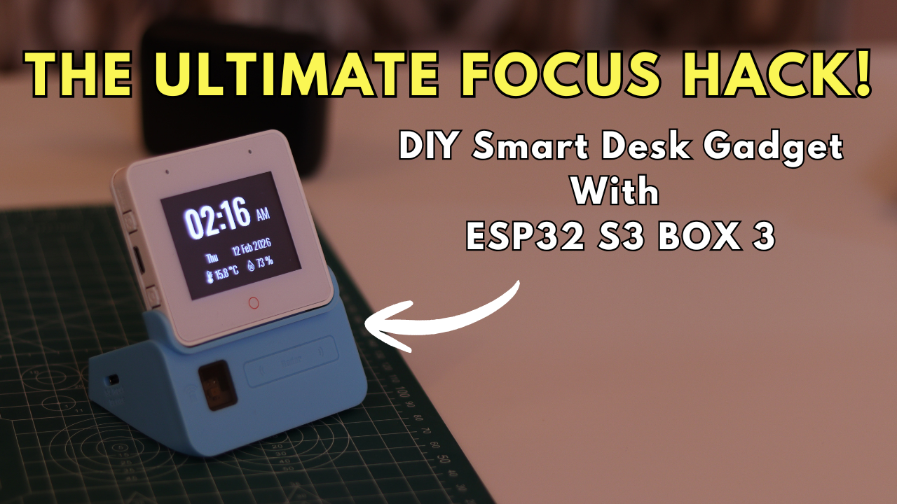
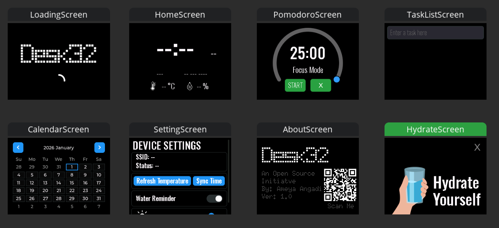

# Desk32: The Ultimate DIY Smart Desk Hub for Deep Work


[](https://www.gnu.org/licenses/gpl-3.0)
[](https://github.com/espressif/esp-box/blob/master/docs/hardware_overview/esp32_s3_box_3/hardware_overview_for_box_3.md)

**Desk32** is a standalone productivity accessory designed to act as a **"Focus Anchor"**. In an era of endless notifications and "Digital Fatigue," Desk32 reclaims your attention by providing essential tools like a specialized Pomodoro timer, a dynamic task manager, and health reminders, all of which are integrated into a sleek, professional interface.

> **The Maker's Perspective:** I built Desk32 to manage my own workload during exams. I realized that using a Pomodoro timer and a clear task list was the one of the only ways I could manage my workload, but I needed a device that lived on my desk, not on my phone.

---

## Video Demonstration
[](https://youtu.be/7ImN2L3nb7k)

*Click the above image to watch the full technical walkthrough and performance demo.*

---

## Key Features
* **Pomodoro Engine:** Custom work/break cycles with automated transitions.
* **Dynamic Task Manager:** Smart Task manager to add tasks and mark them complete.
* **Health Reminders:** Smart hydration alerts triggered every 30 minutes to maintain physical wellness.
* **Wire-Free Integration:** Zero "spaghetti wiring" thanks to the integrated S3-BOX-3 architecture.
* **8-10 Hour Battery Life:** Real-world tested portability for a full workday session.

---

## Hardware & Circuitry
The core innovation of Desk32 lies in its **integrated hardware architecture**. Instead of using messy jumper wires, the ESP32-S3-BOX-3 communicates with the Sensor Dock via a high-speed, **internal connector**.

### **Internal Architecture**

*Credit: [Espressif Systems GitHub](https://github.com/espressif/esp-box/blob/master/docs/hardware_overview/esp32_s3_box_3/hardware_overview_for_box_3.md)*

### **Pinout & Interconnects**


*Credit: [Espressif Systems GitHub](https://github.com/espressif/esp-box/blob/master/docs/hardware_overview/esp32_s3_box_3/hardware_overview_for_box_3.md)*


## Hardware Assembly
The assembly of Desk32 is a seamless, "snap-fit" process that eliminates the need for external wiring.

1.  **Prepare the Base:** Familiarize yourself with the ESP32-S3-BOX-3-SENSOR dock layout.
2.  **Battery Installation:** Insert a high-quality **18650 Li-ion battery** into the holder.
    * **Verified Performance:** 8 hours runtime at 100% brightness; 10 hours at 50% brightness.
3.  **Snap-Fit Docking:** Align the display module with the expansion header and press firmly to establish the electrical path.


*(1) Standalone modules, (2) Alignment, (3) Final Docking.*

---

## Software & Installation

### **1. Libraries Required**
Install the following via the Arduino Library Manager:
* **LVGL (v8.3.x)** - Graphics Engine.
* **ArduinoJson** - Weather API parsing.
* **ESP Panel** - Hardware drivers.
* **NTP Client** - Time synchronization.

### **2. Critical Setup Note**
To match the UI design, you must **delete** the default `lvgl`, `ui` folders, and `lv_conf.h` from your `Documents\Arduino\libraries\` directory and **paste** the versions provided in this repository's `/Libraries` folder.

### **3. Configuration**
Update your WiFi and API credentials in the main firmware:
```cpp
const char* ssid = "";                             // Update: Your WiFi SSID
const char* password = "";                         // Update: Your WiFi Password
const char* apiKey = "";                           // Update: OpenWeatherMap API Key
const char* city = "";                             // Update: Your City
const char* country = "";                          // Update: Your Country Code
```
---
## UI Design (SquareLine Studio)

The interface was crafted using **SquareLine Studio**, a visual UI editor. This allowed for a "Design Thinking" approach, ensuring the UI stayed minimalist and intuitive. The tool generated the high-performance C files used to drive the 60FPS animations.



---

## Future Improvements
* **Local Voice Control:** Hands-free timer commands using the onboard dual-microphone array.
* **SD-Card Persistence:** Saving tasks to the Micro-SD slot to save them permenantly.
* **Context-Aware Logic:** Triggering ventilation/movement alerts based on integrated sensors in the sensor dock.

---

## Conclusion
Desk32 was a personal mission to reclaim my focus. By moving toward an **"intent-first" workflow**, I found a significant boost in productivity. This project is an **Open Source Initiative** under the **GPL v3 license**. I invite you to adapt Desk32 to your own study habits.

---

**Created by Ameya Angadi | 2026**
